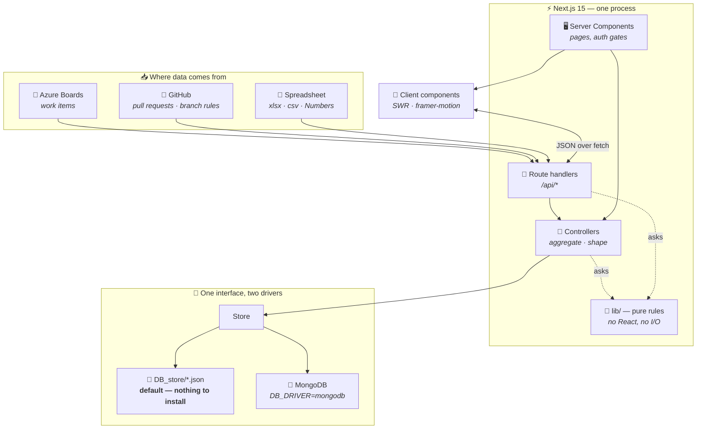
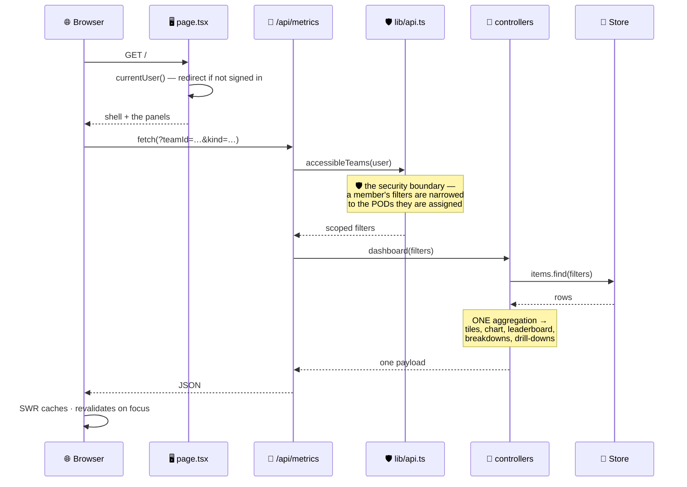
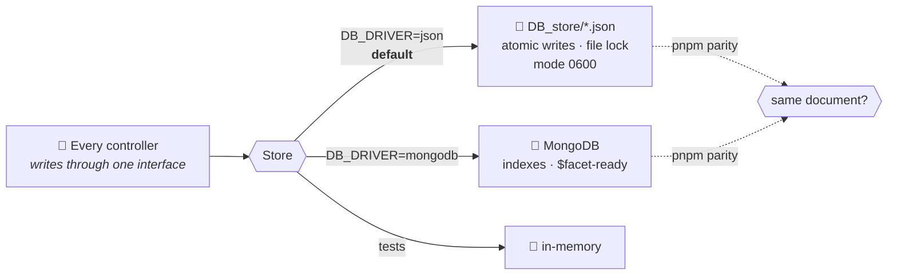
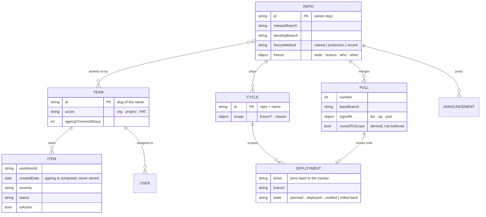
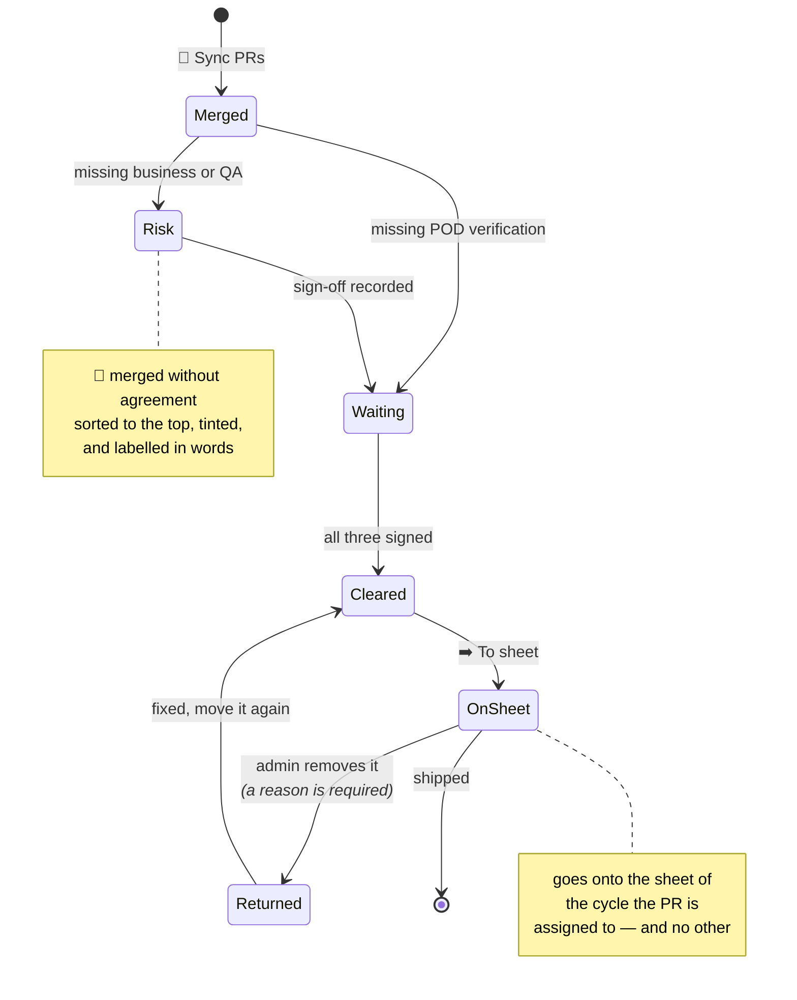
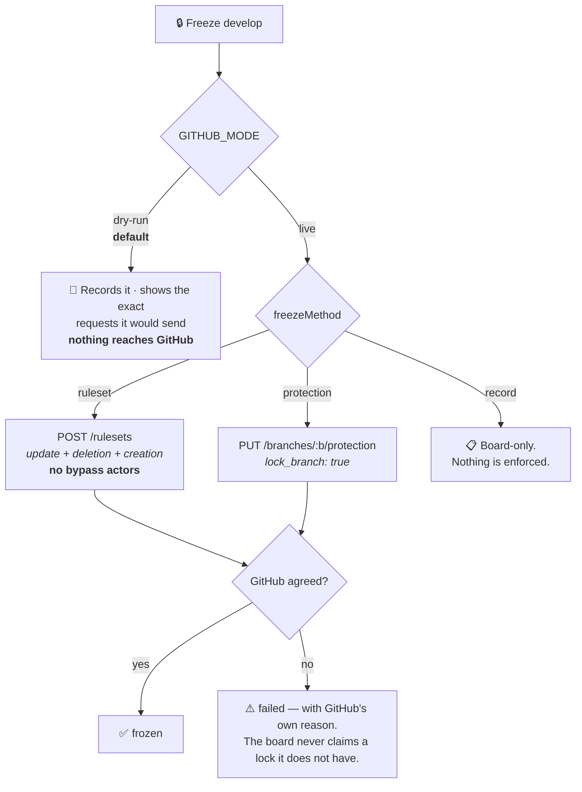
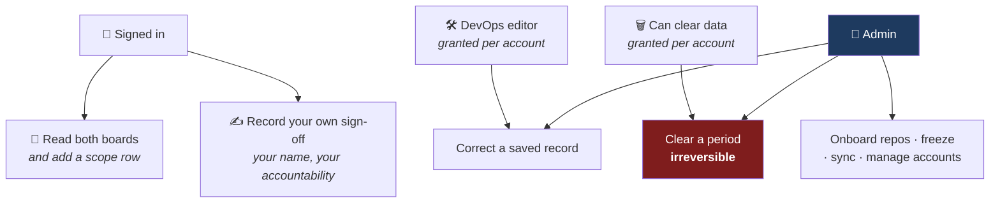
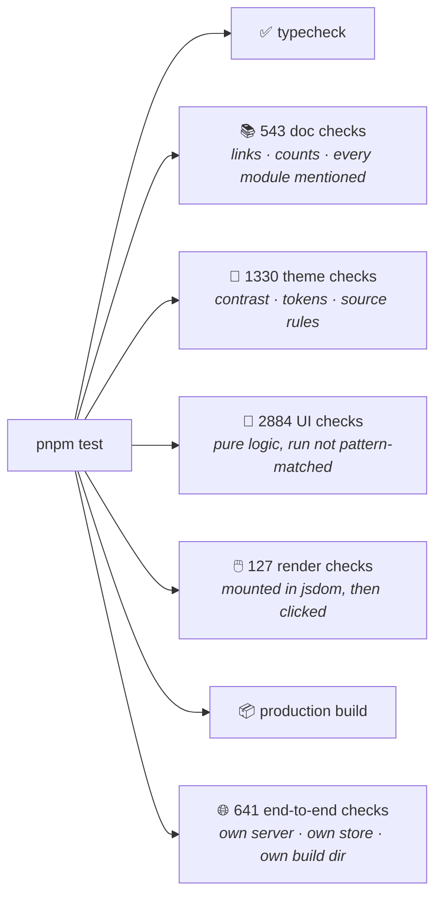

<div align="center">

# 🚀 POD Tracker

**Two boards, one shell.**
How bad is the bug pile — and can I push to `develop` right now?

`Next.js 15` · `React 19` · `TypeScript strict` · `Tailwind v4` · `JSON or MongoDB`

**Zero configuration to first run.** Clone, `pnpm install`, `pnpm dev`. No database, no account, no keys.

</div>

---

## 🎯 What this is

Two dashboards that answer two questions nobody could answer with a straight face before.

<table>
<tr>
<th width="50%">📊 The POD board &nbsp;<code>/</code></th>
<th width="50%">🔀 The DevOps board &nbsp;<code>/devops</code></th>
</tr>
<tr valign="top">
<td>

> 😰 "we have like… 40 open?"
> 😬 "no, 106 — I counted Tuesday"
> 🙃 "counted *what*, exactly?"

Every bug, ticket and CR across every team, pulled from **Azure Boards** or a
spreadsheet you drag in. One honest number, and every number clicks through to
the rows behind it.

**Ageing is the point.** Not "how many bugs" — *how long has this been sitting
there*.

</td>
<td>

> 😵 "is develop frozen?"
> 😐 "…ask Raj?"
> 🫠 "Raj is on leave"

Which branch is locked, what went out in this release, and **which changes
reached the release branch without anybody signing them off**.

**The sign-off report is the point.** Everything else on it is context for
finding those rows.

</td>
</tr>
</table>

A **POD** is just a team. Yours might call them squads or "the payments lot".
Here they're PODs. 🫛

---

## 🏛️ Architecture at a glance

One Next.js app is the frontend *and* the backend. Everything reaches storage
through a single `Store` interface, so the same code serves files or a database.



### The rule the whole project is built on

> **One number, computed once.**
>
> Every tile, chart and drill-down on a board comes from **one** aggregation over
> **one** set of rows. Not eight queries that each round differently — a bar
> saying 45 above a drawer listing 42 is the one bug this project exists not to
> have.
>
> The driver *fetches*. It never aggregates. That is why files and MongoDB
> cannot disagree.

### What it refuses to do

| ❌ | Why |
|---|---|
| Invent weather it doesn't know | No coordinates → no weather. Never a guess drawn as fact. |
| Freeze a branch by accident | GitHub writes are **dry-run by default**. `live` is opt-in, per deployment. |
| Delete on a malformed request | An empty period matches **nothing**, not everything. |
| Trust the browser | Every gate is re-checked server-side. Hiding a button is not a permission. |

---

## ⚡ Quick start

```bash
pnpm install
pnpm dev          # → http://localhost:3000
```

That is genuinely all. No database, no `.env`, no account — the JSON driver
writes files under `DB_store/`, and the first sign-in creates the admin from
built-in defaults (`admin@example.com` / `changeme`).

```bash
pnpm seed             # demo PODs + work items for the POD board
pnpm seed:devops      # 4 of each kind, per repo, per branch, for the DevOps board
```

> 🔑 **Change the admin password** before anyone else can reach the instance.
> 🧭 **One dev server at a time.** `pnpm predev` refuses a second one — two share
> a `.next` and the browser starts failing with `ChunkLoadError`.

---

## 🗺️ How a request actually flows

Reading the POD board, end to end. The interesting part is that **the aggregation
happens once, above the driver**.



`lib/api.ts` is the boundary that matters. A member cannot widen their own scope
by editing a query string, because the scope is **recomputed from the session**,
never read from the request.

---

## 💾 Storage — one interface, two drivers

Switching is **one environment variable**. Nothing else changes, because nothing
else knows.



| | `json` | `mongodb` |
|---|---|---|
| Needs installing | **nothing** | a cluster or `pnpm mongo:local` |
| Where it lives | `DB_store/` (or `DB_STORE_DIR`) | `MONGODB_URI` |
| Good for | a laptop, a locked-down machine, a demo | production, more than one server process |
| Writes | temp file + atomic rename, `0600` | replace-by-id, upsert |

Both go through the **same schemas** (`db/document.ts`), so what a file stores is
what MongoDB would store.

**Switching after you have deployed is two commands:**

```bash
pnpm migrate --to mongodb     # move the data (both directions; source untouched)
# then set DB_DRIVER=mongodb and restart
```

The flag alone changes which store the app *uses* — it moves nothing, which is
why `pnpm migrate` exists. It refuses a target that already holds rows, names any
row that will not validate rather than dropping it, and builds MongoDB's indexes
at the end. `pnpm parity` proves the two drivers agree before you trust either.

> 🔒 The JSON files hold password hashes, and access tokens once you onboard
> anything. They are written `0600`, and `pnpm check:env` tells you if git is
> tracking them. See [Data at rest](docs/operations.md).

---

## 🧬 The data model



**Two details worth knowing:**

- 🕰️ **Age is never stored.** It is computed from `createdDate` at query time.
  A stored age is wrong by tomorrow.
- 🔗 **`movedToScope` is a join, not a flag.** Whether a PR is on a sheet is
  *recomputed* from the sheets themselves, so a board in a broken state repairs
  itself the moment somebody opens it.

---

## 🔀 The DevOps flow

The whole point of the second board: a change reaches the release branch, and
somebody has to agree it should have.



**A move is refused for exactly one reason at a time,** and the tooltip says
which:

| Refusal | Because |
|---|---|
| Not a DevOps editor | checked **first**, before the PR is even looked up — so a refusal leaks nothing |
| No cycle set | there is no sheet to move it onto until somebody says which |
| Scope frozen | *"This pull request can't be moved — the scope sheet for 2026.09 is frozen: …"* |
| Missing a sign-off | **all three**, not just two. The sheet is the record of what shipped |
| Already moved | it says "On the sheet" rather than offering a button that would refuse |

The rule is **one shared function**, so the disabled button and the API can never
disagree.

### Freezing a branch



> 🔑 **What the token can do.** Reading PRs needs `Pull requests: Read`. Only
> freezing needs `Administration: write` — and it never pushes, merges, or
> changes a single file. Full breakdown in [devops.md](docs/devops.md).

---

## 🔐 Who can do what

Four rights, kept deliberately apart. Folding any two together would mean handing
out the dangerous one to grant the harmless one.



- **Adding** a scope row is open to everyone — the person who shipped a change
  knows what it was, and a sheet only some people can fill is a sheet nobody fills.
- **Correcting** one is not. Once written, a record is evidence.
- **Clearing data** is its own right because it is the only irreversible act on
  either board. A DevOps editor does not get it for free.

---

## 🧪 The checks

This project's favourite thing. Seven suites, one command.



```bash
pnpm test                 # everything
pnpm test --no-server     # skip the end-to-end suite
pnpm check:ui             # static, fast, no server
pnpm check:env            # what's broken on this machine, and the fix
```

**Every case corresponds to a bug that was real at some point.** The render suite
exists because a regex proved an expandable row's markup was *written*, not that
it *worked* — it shipped broken twice. The suite now mounts it and clicks.

The end-to-end suite gives itself its own store, its own port **and its own build
directory**, so it cannot touch the `.next` your dev server is reading.

---

## ⚙️ Configuration — env files only

Everything is an environment variable or a reviewed constant. Nothing else to do.

| File | Board | Holds |
|---|---|---|
| `.env.local` | 📊 POD | `DB_DRIVER` · `MONGODB_*` · `AUTH_*` · `AZDO_*` · `SYNC_POLL_SECONDS` · weather |
| `.env.devopsdashboard` | 🔀 DevOps | `DEVOPS_ACCESS` · `GITHUB_MODE` · `GITHUB_TOKEN` · `GITHUB_API_URL` · page size |
| `.env.devopsdashboard.local` | 🔀 DevOps | your **real** token — git-ignored, and it overrides the file above |

> **Where a value belongs.** Anything that differs between deployments, or must
> never be committed, is an env var. Anything that is a *product decision* —
> field caps, page sizes, how long a toast stays up — is a constant in
> `src/lib/constants/`, so changing it is reviewed.

---

## 📜 Scripts

```bash
# run
pnpm dev · pnpm build · pnpm start

# data
pnpm seed               # POD board: admin + demo PODs + work items
pnpm seed:devops        # DevOps board: 4 of each, per repo, per branch
pnpm delete pod-seed    # clear work items, PODs, sync watermarks
pnpm delete devops-seed # clear repos, cycles, scope rows, PRs, announcements
pnpm parity             # do both drivers store the same document?
pnpm migrate --to mongodb   # move every collection between drivers, either way

# housekeeping
pnpm clear              # node_modules, .next, caches — refuses while dev is running
pnpm mongo:local        # a real MongoDB, nothing installed
pnpm azure:probe        # what Azure actually returns, read-only

# checks
pnpm test · pnpm check · pnpm check:ui · pnpm check:theme · pnpm check:docs · pnpm check:env
```

Destructive scripts **count first, print what they found, and ask.** `--dry-run`
counts only; `--yes` skips the question; without a terminal to ask they refuse
rather than assume.

---

## 🗂️ Where the code lives

```
src/
  lib/
    api.ts                 request → scoped filters   🛡️ the security boundary
    metrics/               every tile and chart, in ONE aggregation
    health.ts              the board score: closed ÷ total
    azure.ts               WIQL + workitemsbatch REST
    normalize/             Azure item · spreadsheet row → our shape
    numbers/               a hand-written Apple Numbers reader 🍎
    constants/             product decisions, reviewed in the repo
    devops/                ← the second board's brain, all pure
      signoff.ts             who agreed, and what that means
      to-scope.ts            may this PR move? one shared rule
      period.ts              a year, a month, a day or a from..to range
      purge.ts               count first, then delete
      github-plan.ts         every request it could send, as data
      editors.ts             the four rights
  db/
    store/                 the Store interface + json · mongo · memory
    schemas/               one shape, both drivers
  app/
    page.tsx               📊 POD board          devops/page.tsx  🔀 DevOps board
    admin/                 PODs · accounts       admin/devops/    repos · cycles
    api/                   metrics · items · teams · sync · upload · export ·
                           repos · cycles · deployments · pulls · announcements
  components/
    devops/                the DevOps board's panels
    ui/                    Panel · Button · Tooltip · Menu · surfaces
    greeting*              the time-of-day scene, and its cast 🐿️
    sky-backdrop           real weather, when you give it coordinates
    parallax-backdrop      the drifting orbs behind the glass
scripts/                   seed · seed-devops · delete-seed · clear · 6 check suites
docs/                      the knowledgebase — start at docs/README.md
```

---

## 📚 Where to go next

| | |
|---|---|
| 🏛️ [architecture.md](docs/architecture.md) | how the layers fit together |
| 🔀 [devops.md](docs/devops.md) | the second board, in full |
| 📐 [data-model.md](docs/data-model.md) | every collection and field |
| 📊 [metrics.md](docs/metrics.md) | how each number is computed |
| 🎨 [design-system.md](docs/design-system.md) | tokens, motion, the rules components obey |
| 🔧 [operations.md](docs/operations.md) | env, deploying, backups, data at rest |
| 🔐 [auth-and-tenancy.md](docs/auth-and-tenancy.md) | roles, scoping, sessions |
| 🆘 [troubleshooting.md](docs/troubleshooting.md) | the errors that look like framework bugs and aren't |
| 🧭 [decisions.md](docs/decisions.md) | why things are the way they are |

---

<div align="center">

### 🎉 That's the tour

**Now go click a number.** They all go somewhere.

*Built with an unreasonable number of checks, and one squirrel.* 🐿️

</div>
