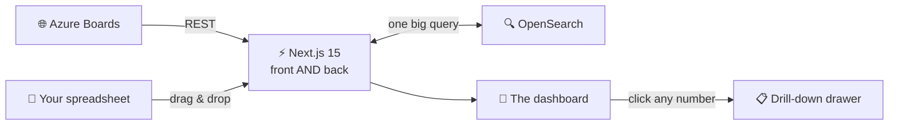
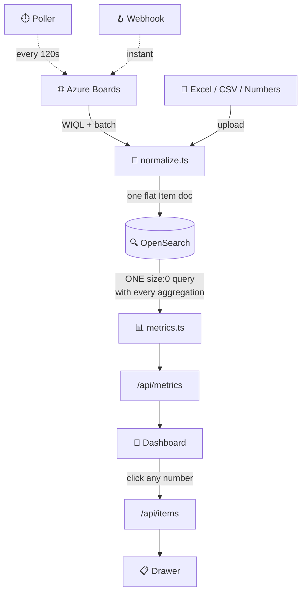
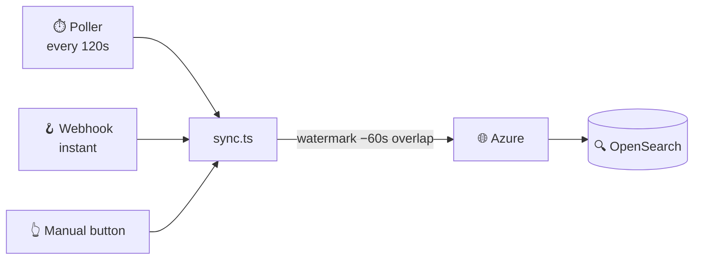

# 🚀 POD Tracker

> **You just cloned this. Now what?**
> Twelve minutes from here to a dashboard full of data. No Azure account needed.
> Grab a coffee ☕ — you probably won't finish it before the seed does.

Ageing bugs, tickets and CRs across every team — live from Azure Boards, or from
a spreadsheet when you just need something on screen.

---

## 🎯 What even is this?

Imagine four teams. Each has a pile of bugs. Nobody agrees how big the pile is.

```
        😰  "we have like… 40 open?"
        😬  "no, 106 — I counted Tuesday"
        🙃  "counted what, exactly?"
        😵  "…bugs?"
```

**POD Tracker is the answer to "how bad is it, actually".** It pulls every bug,
ticket and CR out of Azure DevOps Boards (or a spreadsheet you drag in), and puts
one honest number on a screen.

A **POD** is just a team. Yours might call them squads, pods, or "the payments
lot". Here they're PODs. 🫛

### The one rule this whole project is built on

> **Every number is clickable, and every number agrees with every other number.**

See a bar that says 31? Click it. You get exactly 31 items. Not 30, not 33. The
tile, the bar, the chart and the list all come from **one query**, because the
moment you run two queries the data changes between them and two tiles start
arguing on screen. 🥊

### The four things it refuses to do

| | Rule | Why |
|---|---|---|
| 🚫 | **Never invent data** | No weather configured? No weather drawn. Unknown severity stays `Unknown` — it never guesses which real one you meant. |
| 🚫 | **Never trust a filename** | An upload is read by sniffing its **bytes**. Whoever exported that file wasn't thinking about our parser. |
| 🚫 | **Never mislead** | Can't parse your file? You get a message naming the exact menu path out. A wrong value imported silently is worse than a file politely refused. |
| 🚫 | **Never let a member peek** | POD scoping is enforced server-side, on every route. Not in the UI. Not "mostly". |

---

## 🧰 Tech stack (the whole cast)



| Layer | What we used | Why not something else |
|---|---|---|
| 🖼️ **Framework** | Next.js 15 (App Router) + React 19 | Frontend *and* backend in one repo. One deploy, one language. |
| 🔤 **Language** | TypeScript, strict mode | The compiler catches what tired humans don't. |
| 🎨 **Styling** | Tailwind v4 | Tokens live in `globals.css`. Two themes, both hand-picked. |
| 🗄️ **Store** | OpenSearch | Aggregations are the whole product. A SQL `GROUP BY` per tile would be eight queries that disagree. |
| 🔐 **Auth** | NextAuth v5 | Password, Microsoft SSO, or both. Or off, for local poking. |
| ✨ **Motion** | framer-motion | Springs, not linear fades. |
| 🖇️ **Icons** | lucide-react | |
| 🔄 **Fetching** | SWR | Revalidates on focus, so a board left open stays honest. |
| 📊 **Spreadsheets** | exceljs + a hand-written Apple Numbers reader | Yes, really. More on that below. 👀 |
| 📦 **Packages** | **pnpm** | Pinned in `package.json`. |

> ⚠️ **JavaScript only.** There is no Python anywhere, not even in tooling. The
> test suites are `.mjs` files that import the real `.ts` modules directly.

---

## ⚡ Setup — clone to dashboard

### Step 0 · Do you have the goods? 🎒

```bash
node --version    # need 22.18+ (the checks import .ts files directly)
pnpm --version    # if this fails: corepack enable pnpm
```

<details>
<summary>😱 <b>"pnpm: command not found"</b></summary>

```bash
corepack enable pnpm      # ships with Node, easiest
# or
brew install pnpm
```

Please don't reach for the other package manager. There's a check that fails the
build if any doc tells you to. 😄
</details>

---

### Step 1 · Wake up OpenSearch 🔍

Pick your fighter:

```bash
# 🐳 Containers (easiest — a compose file is right there)
docker compose up -d

# 🍺 Or Homebrew, if you like your databases native
brew install opensearch && brew services start opensearch
```

> ⏳ **It takes 20–40 seconds to accept connections.** This is normal. It is not
> broken. Go stretch. The seeder will tell you plainly if it can't reach it.

Check it's up:

```bash
curl localhost:9200
```

---

### Step 2 · Install 📦

```bash
pnpm install
```

---

### Step 3 · Configure 🔧

```bash
cp .env.example .env.local
```

Now open `.env.local`. **Here is the good news: you can change nothing and it
still works.** 🎉

| Variable | Default | Do I care? |
|---|---|---|
| `OPENSEARCH_URL` | `http://localhost:9200` | 😴 No |
| `OPENSEARCH_INDEX_PREFIX` | `tracker` | 😴 No — until two environments share a cluster |
| `AUTH_MODE` | `password` | 😴 No |
| `AUTH_SECRET` | — | ⚠️ **Yes.** `openssl rand -base64 32` |
| `ADMIN_EMAIL` / `ADMIN_PASSWORD` | `admin@example.com` / `changeme` | 🤔 Change the password before anyone else can reach it |
| `AZDO_ORG_URL` / `AZDO_PROJECT` / `AZDO_PAT` | — | 🌟 Only for real Azure data |
| `WEATHER_LAT` / `WEATHER_LON` | blank | 🎨 Pure joy. See below. |
| `SYNC_POLL_SECONDS` | `120` | 😴 No. `0` turns the poller off |
| `AZDO_WEBHOOK_TOKEN` | — | 🪝 Only for instant Azure updates |

> 🔑 **The Azure block is the only thing you ever *have* to fill in.** Set those
> three and a POD is created for you automatically on first run — no visit to the
> admin screen required. Everything else has a working default.

<details>
<summary>🌦️ <b>The weather thing (optional, delightful)</b></summary>

Set `WEATHER_LAT` and `WEATHER_LON` and the greeting card shows your **actual
local weather** — free, no API key, no account, one request every 15 minutes.

```bash
WEATHER_LAT=18.5204     # Pune
WEATHER_LON=73.8567
```

Leave them blank and **nothing is fetched**. That's deliberate and it's the whole
"never invent data" rule in miniature: a dashboard drawing rain it made up is the
one thing this project must never do. ☔❌
</details>

---

### Step 4 · Seed 🌱

```bash
pnpm seed
```

This creates the indices, your admin login, and **three PODs of realistic demo
data** — enough history that every chart has a shape and every drill-down has
something in it.

```bash
pnpm seed --no-demo    # 🧹 indices + admin only, no demo data
pnpm seed --reset      # 💥 nuke the indices and start over
```

> 🎲 The demo data uses a **fixed random seed**, so every run gives identical
> data. Your screenshots will match your colleague's.

---

### Step 5 · GO 🏁

```bash
pnpm dev
```

Open **http://localhost:3000**, log in with your `ADMIN_EMAIL` / `ADMIN_PASSWORD`.

```
        🎉 You should now be looking at a dashboard
           with a glowing ring, five tiles, some bars,
           and a tiny animated sky with a squirrel in it.
```

Yes, a squirrel. 🐿️ We'll get to that.

---

## 📊 What's on the dashboard

| Panel | Shows |
|---|---|
| 💚 **Board health** | one number: the share of tracked items that are **closed**. Drag the ring to find where each band begins — it springs back on release |
| 🔢 **Headline tiles** | Total · Active · Average ageing · Critical aged · Environments |
| 🏆 **Top assignees** | who holds what, sortable by volume, ageing or criticals. The bar splits their open items by severity |
| 🚨 **Severity** | Critical / Major / Minor / Unknown |
| 🔄 **Bug status** | Open / Commented / For QA Validation / Not a Bug / Closed / Unknown |
| 🌍 **Environment** | IT-UAT / BIZ-UAT / CUG / Production |
| ⏳ **Ageing** | open items bucketed 0–3, 4–7, 8–14, 15–30, 30+ days |
| 📈 **Closure trend** | raised vs closed, daily over 30 days or weekly over 12 |
| 👥 **Leadership roll-up** | every POD side by side (admins only) |

**Everything expands.** 👆 Every tile, row and bar opens a drawer with the matching
work items — title, id, severity, status, environment, assignee, days open — each
linking straight into Azure DevOps.

**Every expanded list filters.** Inside the drawer, narrow by severity, status,
environment, assignee, free text or open/closed, and sort by oldest, newest or
most severe. Whatever the panel already pinned shows as a **locked chip**, so a
filtered list can never contradict the number you clicked. 🔒

Filtering runs against the whole slice, not just the loaded page, and the header
shows the true count. The board re-reads itself every 30 seconds. 🔄

---

## 🗺️ How it actually works



Everything upstream — Azure, a spreadsheet, whatever — gets flattened into **one
document shape**. That's why the aggregations are simple and fast.

### 📄 One item, flattened

```ts
{
  id: "amc-pod:52000",        // POD + work item = collides on re-import 🎯
  teamId: "amc-pod",
  source: "azure",            // or "excel"
  kind: "bug",                // derived: bug | ticket | cr
  title: "Folio search times out beyond 500 results",
  assignee: "Arjun Pillai",
  severity: "Critical",       // Critical | Major | Minor | Unknown
  environment: "Production",  // IT-UAT | BIZ-UAT | CUG | Production | Unknown
  status: "Closed",
  createdDate: "2026-05-25T…",
  closedDate:  "2026-08-08T…",
  isActive: false             // computed, never trusted 🧠
}
```

> 🧠 **`isActive` is computed, not believed.** An item is closed when it has a
> close date **or** its status is terminal. A close date beats whatever the status
> text says — because boards lie, and "In Progress" with a close date is closed.

> 🎯 **The id is the whole re-import story.** Upload the same file twice and you
> get one set of items, not two, because the ids collide and the second upload
> updates the first. That's what makes a weekly export workable.

> ⏱️ **Age is computed at query time**, never stored, so it cannot go stale
> between syncs. And deleting a POD deletes its items too — orphans would skew
> every global count.

---

## 💚 The health score (it's just division!)

Big glowing ring. One number. Here's the entire formula:

```
                    closed
    health  =  ──────────────  ×  100        (then round it)
                    total
```

That's it. That's the whole thing. 🎉

**Worked example** — AMC POD has 244 items, 106 still open:

```
closed  = 244 − 106  = 138
health  = 138 / 244  = 0.5656…
        × 100        = 56.56…
        → round      = 57%   ✅
```

You can check it yourself off the card. **That's the entire point.** 👀

<details>
<summary>🕰️ <b>It used to be much cleverer. That was the problem.</b></summary>

The old score docked points for aged criticals, a stale average age, and an open
backlog — three capped penalties, weighted. On that same board it read **32%**
instead of 57%.

It was more *diagnostic*, and completely unverifiable. Nobody looking at `32`
beside `106 of 244` could connect the two without reading the source.

> **A score that has to be explained before it can be trusted isn't doing its job
> on a dashboard.**

So the diagnosis moved to the tiles *next to* the ring, where the numbers are
named, and the score became the one thing you can check by dividing.
</details>

**What the score deliberately can't see:** age and severity. Three criticals
rotting for a quarter score the same as three trivial items opened this morning.
That's the trade — and it's why *Critical aged* and *Average age* sit right next
to the ring. The score says **how much is left**; those two say **how bad it is**. ⚖️

### 🎨 What the colour means

| Score | Band | Vibe |
|---|---|---|
| 85–100 | 🟢 Holding steady | Someone is doing their job |
| 65–84 | 🟡 Some drag | Keep an eye on it |
| 40–64 | 🟠 Falling behind | Uh oh |
| 0–39 | 🔴 Needs a triage day | Cancel the meeting, clear the board |

> 🎡 **Drag the ring.** It scrubs a hypothetical score so you can find where each
> band starts — "how much would we have to close to be green?". It never changes
> data and springs back when you let go.

---

## ⏳ Ageing — the actual point of the product

Everything here exists to answer **"how long has this been sitting there?"**

| Bucket | Meaning |
|---|---|
| `0-3 days` | 🟦 Fresh |
| `4-7 days` | 🟩 Fine |
| `8-14 days` | 🟨 Hmm |
| `15-30 days` | 🟧 Awkward |
| `30+ days` | 🟥 Someone should say something |

An item counts as **aged** past your POD's threshold (7 days by default).

> 🪤 **The trap that already bit us once:** buckets are lower-inclusive,
> upper-exclusive. Use `lte` for the upper bound and you get one extra item, and
> the drawer disagrees with the bar you clicked. Very hard to spot. Very
> embarrassing. Now guarded by a check.

---

## 🌐 Getting data in — Azure Boards

Fill in the three `AZDO_*` variables and you're done. For per-POD control:
**Admin → pick a POD → Azure Boards**.

| Field | Notes |
|---|---|
| Organisation URL | `https://dev.azure.com/your-org`. Blank falls back to `AZDO_ORG_URL` |
| Project | Blank falls back to `AZDO_PROJECT` |
| Personal access token | Needs **Work Items (Read)**. Blank falls back to `AZDO_PAT`. 🔒 Never sent back to the browser |
| Area path | Scopes this POD's items, and routes incoming webhooks to it |
| Work item types | Defaults to Bug, Issue, Task, User Story |

**Test** checks the connection · **Sync** pulls changes since the last run ·
**Full resync** re-imports the last year.

### 🗺️ Field mapping (boards differ, and that's fine)

Severity, environment and status are mapped **per POD**. Defaults:
`Microsoft.VSTS.Common.Severity`, `Custom.Environment`, `System.State`.

Values resolve in three passes: your POD's own overrides → the shipped table →
a **longest-match substring** pass. So:

```
"1 - Critical"      → Critical      "Resolved"     → For QA Validation
"3 - Medium (UI)"   → Minor         "Deployed to Prod" → Production
"Not a Bug"         → Not a Bug     (beats "Bug" — longest match wins 🧙)
```

> 🏷️ **Environment falls back to tags, then to the area path** when the field is
> missing — which is where most teams actually record it.

### 🔴 Keeping it live



**1. Polling** — every `SYNC_POLL_SECONDS`, a WIQL query on `System.ChangedDate`
with a stored watermark, so each run fetches only what moved. Set `0` to disable.

**2. Webhooks** — instant. In Azure DevOps: *Project settings → Service hooks →
Web Hooks*. One subscription each for **work item created / updated / deleted**,
pointing at:

```
https://your-host/api/webhooks/azure?token=<AZDO_WEBHOOK_TOKEN>
```

The token is compared in **constant time**; requests without it are rejected. 🔐
Locally, expose port 3000 with a tunnel first. The webhook only reads the id and
area path, then re-fetches the canonical work item — payloads are never trusted.

> 💡 **Run both.** The webhook gives instant updates; the poller catches anything
> that happened while the app was down. Sync is watermarked with a minute of
> overlap so nothing slips through the gap, and a **failed sync leaves the
> watermark alone** rather than silently skipping a window. 🛟

---

## 📗 Getting data in — spreadsheets

Hit **Upload**, pick your POD, drop the file. Accepted:

| Format | Status |
|---|---|
| `.xlsx` / `.xlsm` | ✅ |
| `.csv` / `.txt` / `.tsv` | ✅ (or no extension at all — we read the bytes) |
| `.numbers` | ✅ **Yes, Apple Numbers.** See below 👇 |
| `.ods` | ❌ but tells you exactly how to export |
| old binary `.xls` | ❌ but tells you exactly how to export |

**Only one column is mandatory: `Title`.** Everything else has a sensible
fallback. Columns are matched **by name, not position** — reorder them freely,
leave out what you don't have, and unknown columns are ignored rather than
rejected. So exporting straight out of Azure or Jira and uploading it unedited
just… works. 🙌

```
| Work Item ID | Title                    | Severity     | Created Date |
|--------------|--------------------------|--------------|--------------|
| 10432        | PDF download fails       | 1 - Critical | 2026-08-01   |
| 10433        | Nominee name truncated   | 3 - Medium   | 2026-08-14   |
```

Full column list, aliases and fallbacks: [`docs/excel-upload.md`](docs/excel-upload.md).

<details>
<summary>🍎 <b>The Apple Numbers story (a genuinely silly rabbit hole)</b></summary>

`.numbers` is a zip, like `.xlsx`. Nothing else about it is the same. Inside are
IWA files — Apple's own container — each a stream of **Snappy-compressed
Protobuf** against schemas Apple doesn't publish. exceljs can't open one. Nothing
on npmjs.com can either.

So we wrote one. Zip reader → Snappy decompressor → IWA framing → protobuf
walker → cell decoder. About 500 lines.

**Why bother?** On a Mac with no Excel installed, Numbers *is* the spreadsheet
app. Telling someone to export CSV every single time is a tax on the one platform
most likely to be running this.

**How it stays honest:** Apple renumbers those fields between releases, so nothing
trusts a field number it can check instead. A reference is the tile list because
it *resolves to tile archives*. A layout it doesn't recognise yields **no rows
rather than wrong ones**, and you get the "export as CSV" message — so it can only
ever do better than refusing, never worse. 🛡️
</details>

### 📥 And back out again

**Report** in the *For you* menu downloads the current view as `.xlsx` — in
**exactly the format the uploader expects**. Download → edit → upload works with
nothing lost.

That's not a happy accident, it's enforced: export and import share one column
definition, and a check asserts every exported header maps back to the field it
came from. Add a column the importer doesn't know and the suite fails. 🔒

---

## 🔐 Access & roles

`AUTH_MODE` in `.env.local`:

| Mode | Behaviour |
|---|---|
| `off` | 🏠 no login, everyone is a local admin — **local development only** |
| `password` | 🔑 email + password, bcrypt hashed, stored in OpenSearch |
| `entra` | 🏢 Microsoft Entra ID (Azure AD) SSO |
| `both` | 🤝 both offered on the sign-in screen |

**Admins** onboard PODs and see every one of them.
**Members** see only the PODs ticked against their name in *Admin → Dashboard
access*.

> 🛡️ The scoping is applied **server-side**, in the one function that turns a
> request into a filter. A route that builds its own filters has bypassed tenancy
> — which is why that is the single most guarded line in the codebase.

With SSO, the first person to sign in becomes admin; everyone after joins as a
member with no PODs until an admin grants them one.

---

## 👥 Onboarding a POD

**Admin → New POD.** Name it (e.g. `AMC POD`), set the ageing threshold, add each
member with their designation, then connect Azure.

> ⚠️ Member **names must match the Azure Boards display name** — that is what work
> items are attributed by, and what the leaderboard groups on.

People on the roster with nothing assigned still appear, as a real zero rather
than vanishing from the board. 🫥→0️⃣

---

## 🌤️ The sky card (the fun one)

The greeting card is a **little window**. It reads your local clock and draws
what's actually outside:

| Hour | Sky | Who's out |
|---|---|---|
| 🌅 Morning | Blue, warm horizon | 🕊️ A crane, flying |
| ☀️ Afternoon | Bright blue | 🐿️ A squirrel |
| 🌆 Evening | Dusk, peach horizon | 🐈 A cat · 🦇 bats |
| 🌙 Night | Near-black, stars | 🐈 A cat · 🦇 bats |

The sun and moon are placed from the **real clock** — a half-sine from rise to
set — so a 7pm sun sits low on the western horizon instead of blazing overhead.
The moon wears **tonight's actual phase**. 🌒

> 🪟 **The card does not follow your app theme.** Dark mode at 2pm still looks out
> on an afternoon. This was a real bug: the scene colours used to be redefined per
> theme and dimmed for dark, so the sun blazed in a **navy night sky at 2pm** while
> the card said "Good afternoon". A window shows the weather, not your wallpaper.

Scroll down and the card's sky **grows to fill the whole page**. 🖼️ Try it.

---

## 🎨 Themes

**Light and dark, in Bajaj Finserv blue** — inspired by the brand's
blue-and-white identity, anchored on `#0071BB`. White-leaning in light mode, deep
**navy** in dark, so it stays in the brand family rather than reading as a generic
dark theme.

The toggle offers light, dark, or match-your-system. The choice is remembered and
applied **before first paint**, so there's no flash of the wrong theme. ⚡

Both palettes were validated **independently** against their own chart surface
(light `#f6f9fc`, dark `#172533`) — lightness band, chroma floor, colourblind
separation and contrast all pass. The light theme is not a washed-out dark theme.

> 🧪 **Every token must exist in all three theme blocks.** One missing from dark
> silently falls back to its light value, and nobody notices until they open that
> component at night. `pnpm check:theme` fails on exactly that.

---

## ✅ The checks (this project's favourite thing)

```bash
pnpm test              # 🎁 everything — starts a dev server if none is running
```

Or one at a time:

```bash
pnpm exec tsc --noEmit   # must be clean
pnpm check:ui            # pure logic — imports the REAL modules
pnpm check:theme         # tokens, contrast, source rules
pnpm check:docs          # these docs still match the code
pnpm check               # end-to-end, needs a running server
```

**Nearly 1,900 checks.** Every one of them exists because something was broken
once.

### 🧬 The rule that matters most

> **A check that reimplements what it checks tests only its own copy.**

This project learned that the hard way: the UI suite used to *mirror* the logic
it was checking, so three knowingly-broken builds sailed straight through. 🫠

Now the suites **import the real modules**, and every new check gets
**mutation-tested** — deliberately break the code and confirm the check screams.
If it doesn't scream, it isn't a check, it's decoration. 🎭

---

## 🆘 Something's broken

| 😵 Symptom | 💡 Likely cause |
|---|---|
| Seed fails instantly | OpenSearch isn't up yet. Wait 30s, `curl localhost:9200` |
| `Cannot find module './chunks/…'` | You ran `pnpm build` while `pnpm dev` was running. Stop dev, delete `.next`, restart |
| Upload says "no Title column" | Your header row isn't row 1. The error lists every tab and what it found |
| Login rejects you | `AUTH_SECRET` unset, or you never ran `pnpm seed` |
| Dark mode looks wrong somewhere | A token missing from a dark block. `pnpm check:theme` will name it |
| Webhook does nothing | `AZDO_WEBHOOK_TOKEN` unset — every request is rejected until it is set |
| A number disagrees with its drawer | 🚨 Genuinely a bug. `pnpm check invariants` catches this class |

Full symptom → cause table, including every bug already fixed here:
[`docs/troubleshooting.md`](docs/troubleshooting.md).

---

## 📚 Where to go next

| I want to… | Read |
|---|---|
| 🏗️ **Rebuild this from scratch** (or brief an LLM) | [`docs/rebuilding.md`](docs/rebuilding.md) |
| 🧭 Understand the architecture | [`docs/architecture.md`](docs/architecture.md) |
| 🗄️ Know the data model | [`docs/data-model.md`](docs/data-model.md) |
| 📊 See every chart's aggregation | [`docs/metrics.md`](docs/metrics.md) |
| 🌐 Wire up Azure properly | [`docs/azure-integration.md`](docs/azure-integration.md) |
| 🔐 Understand auth & tenancy | [`docs/auth-and-tenancy.md`](docs/auth-and-tenancy.md) |
| 🎨 Touch anything visual | [`docs/design-system.md`](docs/design-system.md) |
| ⚙️ Deploy or operate it | [`docs/operations.md`](docs/operations.md) |
| 📗 Get the spreadsheet format exactly right | [`docs/excel-upload.md`](docs/excel-upload.md) |
| 🤔 Ask "why on earth is it like that" | [`docs/decisions.md`](docs/decisions.md) |

---

## 🗂️ Where the code lives

```
src/
  lib/              domain and data — no React, server-only
    opensearch.ts   client, index bootstrap, bulk upsert
    mappings.json   index mappings — shared with scripts/seed.mjs
    metrics.ts      every tile and chart, in ONE aggregation query
    health.ts       the board score: closed ÷ total
    azure.ts        WIQL + workitemsbatch REST calls
    normalize.ts    Azure work item / spreadsheet row → our shape
    sync.ts         watermarked incremental sync, webhook routing
    poller.ts       background poll timer
    numbers.ts      the Apple Numbers reader 🍎
    api.ts          request → scoped filters  ← the security boundary 🛡️
  app/
    page.tsx        dashboard    admin/    login/
    api/            metrics · items · teams · sync · upload · export ·
                    users · webhooks/azure
  components/       dashboard-client, health-ring, stat-rail, leaderboard,
                    breakdown-card, trend-chart, team-rollup, drill-drawer,
                    greeting (+ scene + cast 🐿️), sky-backdrop,
                    parallax-backdrop (the drifting orbs behind the glass),
                    search-box, theme-toggle, footer, topbar, ui
scripts/            seed + four check suites
```

---

<div align="center">

### 🎉 That's the tour!

**Now go click a number.** Any number. They all go somewhere.

*Built with an unreasonable number of checks, and one squirrel.* 🐿️

</div>
